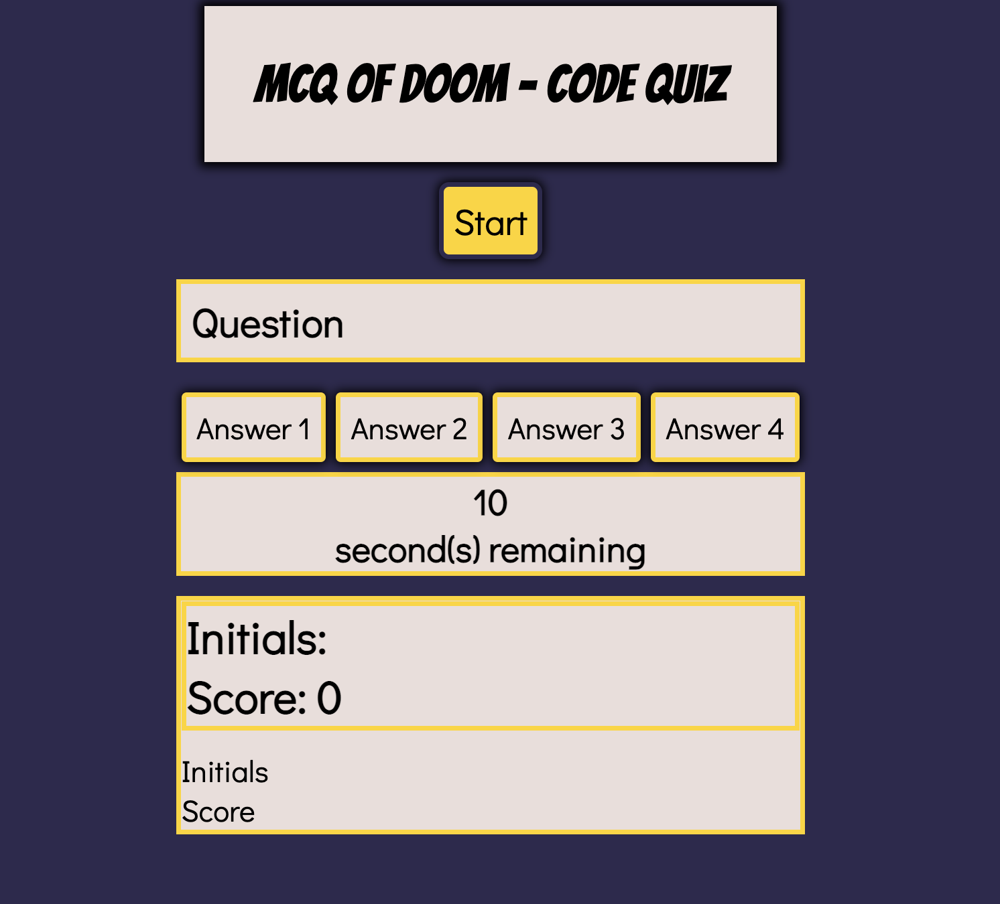

# MCQ of Doom - Code Quiz

## Description

The following application is a "simple" coding quiz in a multiple choice format. When you get a wrong answer, the time is decreased by 15 seconds. If you answer all the questions correctly, you will get a "You Win" prompt, asking you to give your initals to store and then put on a leaderboard. If you lose, you can start the game if you wish by refreshing the browser.

Electronic quizzes are very useful in that it is possible to populate data eventually and compare if it is being used with a large group of people. I think it would be very useful, if I were to create a quiz for students to test their knowledge and evaluate it, without the tedious work and formatting of Google Forms. However, I think is a project for the future. 

The following quiz taught me more about how functions work, breaking things down, and the importance of Console logging problems. I learned how to set and select buttons and answers and set a for loop to access the possible results in an array of questions and answers. Decreasing time was a challenge and finding the correct syntax, was also a hurdle, but was eventually overcome.

Repo link: https://github.com/godwingi/code-quiz

Website link: 

## Table of Contents (Optional)

N/A

## Installation
N/A

## Usage

Click the "Start" button to start the timer and the questions. There will be 5 questions to answer within the time limit. Be careful, if you choose the wrong answer, you will lose 15 seconds to your time.

Here is what the landing page looks like:

## Credits

AskBCS for their support.

## License

N/A
---